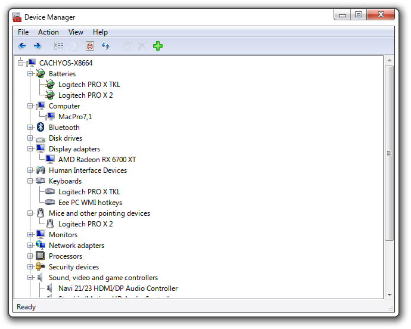
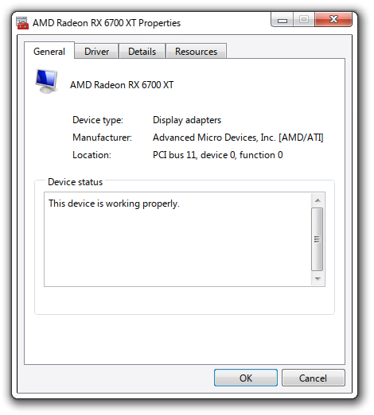
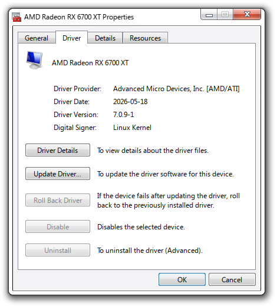
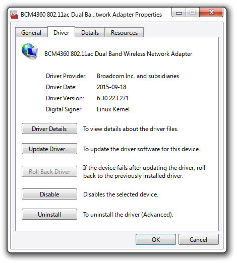
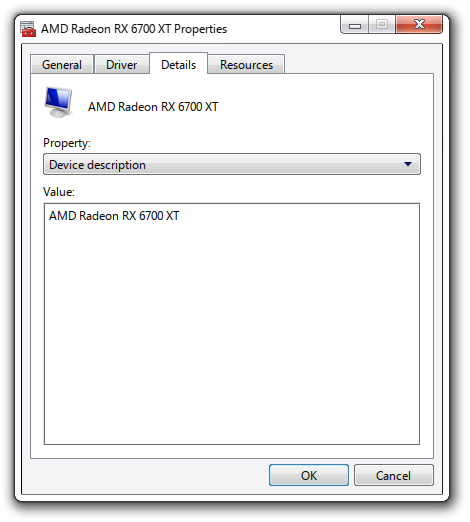
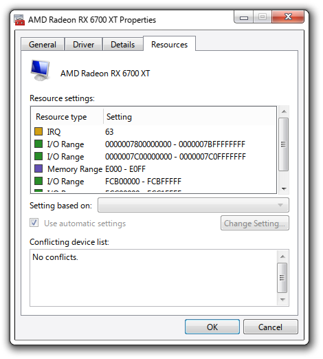

<div align="center">

  # linux-devmgmt
  <i>The Windows Device Manager, on Linux</i>

  <p>
    A faithful recreation of the Windows Device Manager built with Qt6 and real hardware backends via sysfs/procfs. Best enjoyed with <a href="https://github.com/aeroshell-desktop/aerothemeplasma">AeroThemePlasma</a>, but looks great on regular KDE as well.
  </p>

</div>
<br>

> [!NOTE]
> **Built for CachyOS / Arch Linux.** Also packaged as a Nix flake for NixOS.<br>Some features (DKMS uninstall, driver date lookup) depend on `dkms` and `pacman`. Other distros may need minor adjustments.

| | | |
|:-------------------------:|:-------------------------:|:-------------------------:|
|  |  |  |
|  |  |  |


## Building

### Arch / CachyOS

```bash
sudo pacman -S qt6-base cmake
cmake -B build
cmake --build build -j
./build/devmgmt
```

### Nix

```bash
nix build
./result/bin/devmgmt

# or run directly
nix run
```

A dev shell with Qt Creator and GDB is also available:

```bash
nix develop
```

## Runtime dependencies

On Arch, you need these installed separately. The Nix flake handles all of them automatically.

| Tool | Purpose |
|------|---------|
| `pkexec` | Privilege escalation for enable/disable/uninstall |
| `modinfo` | Driver details |
| `bluetoothctl` | Bluetooth device disconnect |
| `dkms` | *(optional)* DKMS driver management |
| `pacman` | *(optional)* Package date lookup |

## Features

- Full two-level device tree (by type) backed by real sysfs/procfs data
- Per-device Properties dialog with General, Driver, Details, and Resources tabs
- Enable / disable devices via kernel module blacklisting
- Uninstall DKMS drivers
- Update Driver wizard
- Driver Details viewer (`modinfo` output)
- Scan for hardware changes
